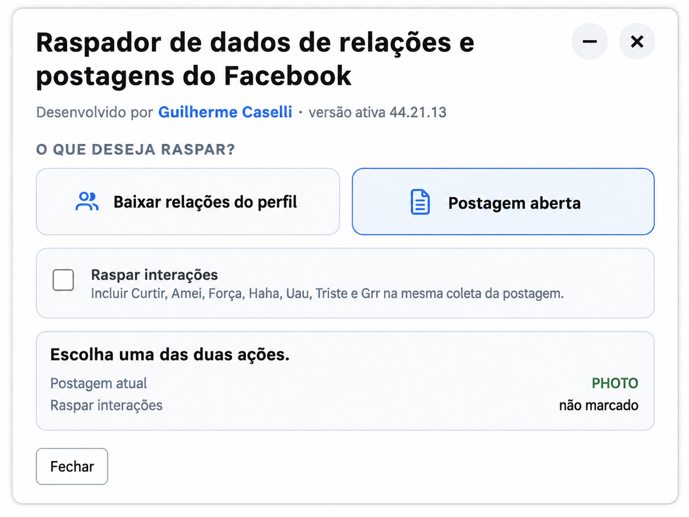
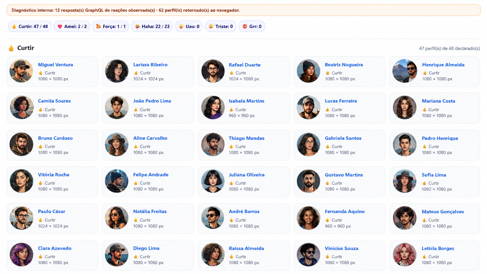
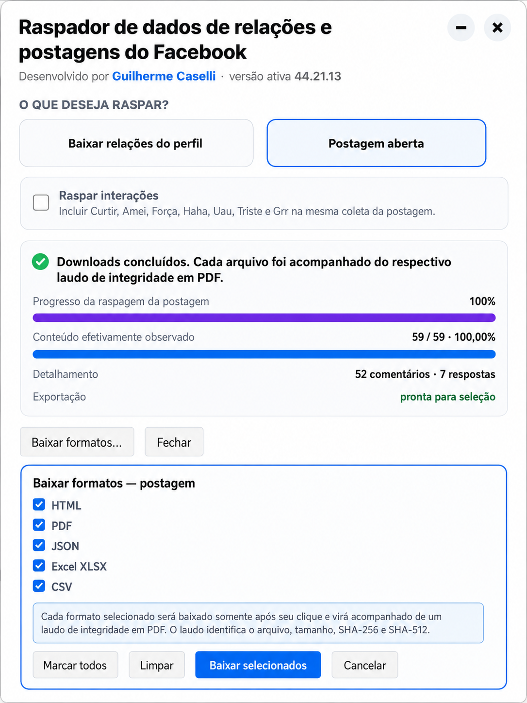

  

<h1 align="center">Raspador de Dados de Relações e Postagens do Facebook</h1>

  
  
  
  
  
  

---

# 🔎 RASPADOR DE DADOS DE RELAÇÕES E POSTAGENS DO FACEBOOK

Ferramenta baseada em extensão para navegador, desenvolvida para coleta estruturada de dados disponibilizados ao navegador durante a navegação no Facebook.

A aplicação foi projetada para apoiar atividades de investigação digital, inteligência, OSINT, documentação técnica, preservação de conteúdo e análise de dados públicos ou legitimamente acessíveis à sessão autenticada do usuário.

A ferramenta atua diretamente no ambiente do navegador e trabalha com os elementos visíveis e com as estruturas entregues pelo Facebook à página aberta. O sistema organiza os dados coletados em relatórios visuais e arquivos estruturados, preservando comentários, respostas, metadados, mídias, reações, hyperlinks, avatares e indicadores de integridade.

A versão estável atual é:

    44.21.15

---

# ⚙️ FASE 1 — PREPARAÇÃO DO AMBIENTE

Antes de utilizar a ferramenta, é necessário possuir:

- 🟢 Navegador Google Chrome ou outro navegador baseado em Chromium
- 🟢 Acesso à plataforma Facebook
- 🟢 Sessão autenticada, quando o conteúdo exigir login
- 🟢 Permissão para instalar extensões em modo desenvolvedor
- 🟢 Conexão estável durante a coleta
- 🟢 Postagem, foto, Reel ou página de relações corretamente carregada

---

# 🔍 FASE 2 — VERIFICAÇÃO DO AMBIENTE

Certifique-se de que:

- ✔ O Google Chrome está atualizado
- ✔ A página do Facebook carrega normalmente
- ✔ O modo desenvolvedor está habilitado no navegador
- ✔ Não existe outra versão antiga da extensão ativa
- ✔ O arquivo `manifest.json` está diretamente na pasta selecionada
- ✔ A postagem foi aberta em página própria, visualizador de foto ou URL direta do Reel
- ✔ O painel de comentários está visível quando houver comentários a coletar

---

# 📥 FASE 3 — DOWNLOAD DA FERRAMENTA

Existem duas formas distintas para realizar o download da ferramenta:

1. 📦 Download direto pela página do projeto no GitHub, sem necessidade de instalar o Git
2. 🖥️ Download via Git, utilizando o Prompt de Comando, PowerShell ou Terminal

---

## 📦 OPÇÃO 1 — DOWNLOAD DIRETO PELA PÁGINA DO PROJETO

1. Acesse o repositório:

    https://github.com/manualdeinvestigacaodigital/Facebook-Raspador-de-dados-relacoes-e-postagen

2. Clique no botão verde **`<> Code`**

3. Selecione a opção **`Download ZIP`**

4. Aguarde o download do arquivo compactado

5. Extraia o conteúdo do ZIP em uma pasta de sua preferência

6. Abra a pasta extraída e confirme que nela estão diretamente:

    manifest.json  
    content.js  
    post_scraper_module.js  
    unified_controller.js  
    service_worker.js

---

## 🖥️ OPÇÃO 2 — DOWNLOAD VIA GIT

O Git é uma ferramenta utilizada para baixar e atualizar projetos hospedados no GitHub.

### 🔎 VERIFICAR SE O GIT ESTÁ INSTALADO

Abra o Prompt de Comando, PowerShell ou Terminal e execute:

    git --version

### ✅ Resultado esperado

    git version 2.x.x.windows.x

### ❌ Caso o Git não esteja instalado

Acesse:

    https://git-scm.com/download/win

Baixe e instale o Git for Windows. Durante a instalação, podem ser mantidas as opções padrão.

Depois, feche e abra novamente o terminal e execute:

    git --version

---

### 🚀 CLONAR O REPOSITÓRIO

Execute:

    git clone https://github.com/manualdeinvestigacaodigital/Facebook-Raspador-de-dados-relacoes-e-postagen.git

A pasta criada será:

    Facebook-Raspador-de-dados-relacoes-e-postagen

Entre nela:

    cd Facebook-Raspador-de-dados-relacoes-e-postagen

---

# 🔧 FASE 4 — INSTALAÇÃO DA EXTENSÃO NO GOOGLE CHROME

## 🌐 1. ABRIR A PÁGINA DE EXTENSÕES

Abra o Google Chrome e acesse:

    chrome://extensions/

---

## 🛠️ 2. ATIVAR O MODO DESENVOLVEDOR

No canto superior direito da página de extensões:

- localize a opção **Modo do desenvolvedor**
- ative a chave

Quando o modo desenvolvedor estiver habilitado, o Chrome exibirá opções adicionais.

---

## 📂 3. CARREGAR A EXTENSÃO SEM COMPACTAÇÃO

Clique em:

- 👉 **Carregar sem compactação**

Selecione a pasta que contém diretamente o arquivo:

    manifest.json

Não selecione o ZIP. A pasta precisa estar extraída.

Depois do carregamento:

- ✔ confira se a extensão aparece no Chrome
- ✔ confirme a versão ativa
- ✔ fixe o ícone da extensão na barra do navegador, se desejar

---

# 🌐 FASE 5 — INTERFACE DA FERRAMENTA

A extensão apresenta dois fluxos principais:

1. **Baixar relações do perfil**
2. **Postagem aberta**

Também existe a opção:

- **Raspar interações**

Essa opção permite incluir na mesma coleta os perfis materializados pelo Facebook nos grupos de reação.

  

A ferramenta identifica automaticamente o contexto atualmente aberto:

- `POST` — postagem tradicional
- `PHOTO` — publicação exibida no visualizador de fotos
- `REEL` — vídeo ou Reel
- página de relações — lista de amigos ou relações visíveis

---

# 🚀 FASE 6 — EXECUÇÃO DA FERRAMENTA

## 👥 COLETA DE RELAÇÕES DO PERFIL

1. Abra o perfil desejado
2. Acesse a página de amigos ou relações visíveis
3. Clique no ícone da extensão
4. Selecione **Baixar relações do perfil**
5. Aguarde a coleta progressiva
6. Selecione os formatos de exportação

A ferramenta poderá coletar, quando disponíveis:

- nome
- URL do perfil
- avatar
- identificadores observados
- vínculo relacional exibido
- dados presentes no cartão
- origem da coleta
- data e hora do processamento

---

## 📝 COLETA DE POSTAGEM TRADICIONAL

1. Abra a postagem em página própria ou em diálogo expandido
2. Clique no ícone da extensão
3. Marque **Raspar interações**, quando necessário
4. Clique em **Postagem aberta**
5. Aguarde a conclusão
6. Confira a quantidade declarada e a quantidade observada
7. Selecione os formatos para download

---

## 🖼️ COLETA DE FOTO

1. Abra a fotografia no visualizador do Facebook
2. Confirme que o painel lateral da foto está visível
3. Clique no ícone da extensão
4. Selecione **Postagem aberta**
5. Aguarde a seleção de todos os comentários
6. Aguarde a expansão das respostas
7. Exporte os formatos desejados

A ferramenta preserva, quando disponíveis:

- fotografia principal
- autor
- avatar do autor
- legenda
- data
- local
- privacidade
- álbum
- comentários
- respostas
- métricas
- interações

---

## 🎬 COLETA DE REEL OU VÍDEO

1. Abra diretamente a URL do Reel
2. Não troque de Reel durante a coleta
3. Clique no ícone da extensão
4. Marque **Raspar interações**, se necessário
5. Clique em **Postagem aberta**
6. Aguarde a coleta dos comentários, respostas, métricas e mídia
7. Exporte os resultados

No formato `REEL`, a versão estável utiliza vínculo exato da mídia com a rota ativa.

Isso significa que a extensão rejeita:

- mídia pertencente a outro Reel
- vídeos carregados em segundo plano
- recomendações adjacentes
- conteúdo observado em uma rota anterior

Quando uma URL MP4 comprovadamente vinculada ao Reel não está disponível, a ferramenta preserva o poster do vídeo atual.

---

# 🚀 FASE 7 — FUNCIONAMENTO INTERNO DA FERRAMENTA

A extensão atua diretamente na página aberta pelo usuário e utiliza componentes separados para:

- controle da interface
- detecção do contexto
- preflight da página
- leitura do DOM
- coleta progressiva
- abertura de comentários
- expansão de respostas
- associação de avatares
- coleta de reações
- vínculo de mídias
- geração de relatórios
- criação de hashes
- exportação de arquivos

---

## 📡 COLETA DE DADOS

A ferramenta observa apenas dados entregues ao navegador durante a sessão.

A coleta pode utilizar:

- DOM da página
- atributos acessíveis
- hyperlinks
- identificadores presentes na rota
- dados materializados no painel de comentários
- respostas GraphQL sanitizadas entregues ao navegador
- elementos de mídia
- contagens visíveis
- estados de carregamento

A ferramenta não deve inventar informações ausentes.

---

## 📊 EXTRAÇÃO DE METADADOS

A ferramenta pode identificar e extrair:

- 📌 ID da postagem
- 📌 ID da foto
- 📌 ID do Reel
- 👤 Autor
- 🔗 URL canônica do autor
- 🖼️ Avatar do autor
- 📝 Texto ou legenda
- 🔗 URL original da publicação
- 📅 Data exibida
- 📅 Data exata, quando materializada
- 🌐 Privacidade ou visibilidade
- 📍 Local associado
- 👥 Pessoas marcadas
- 🔗 Entidades e hyperlinks presentes
- 📊 Métricas observadas
- 💬 Quantidade declarada de comentários
- 🔁 Quantidade de compartilhamentos
- 👁️ Visualizações, quando disponíveis

---

## 📈 ESTATÍSTICAS

A ferramenta coleta, quando disponibilizadas:

- 👍 Reações
- 💬 Comentários
- ↩️ Respostas
- 🔁 Compartilhamentos
- 👁️ Visualizações
- 📊 Quantidade declarada
- 📊 Quantidade efetivamente observada

---

## 💬 COLETA DE COMENTÁRIOS

A ferramenta tenta:

- 🔎 selecionar **Todos os comentários**
- 🔁 expandir respostas
- 📜 percorrer o painel progressivamente
- 🧩 deduplicar registros
- 🧱 preservar a hierarquia
- 🔗 manter hyperlinks
- 🖼️ manter avatares
- 🎞️ manter stickers e GIFs como mídia do comentário

Para cada comentário ou resposta, podem ser preservados:

- autor
- URL do perfil
- avatar
- texto
- mídia anexada
- figurinha
- GIF
- número de curtidas
- data
- identificador técnico
- vínculo com o comentário principal
- hyperlink para o comentário

Quando o Facebook não materializa todo o conteúdo, a ferramenta encerra com **resultado parcial seguro**.

Nesse caso, ela informa:

- quantidade declarada
- quantidade observada
- quantidade exportada
- motivo terminal

---

## 😀 COLETA DE INTERAÇÕES

Quando a opção **Raspar interações** está marcada, a ferramenta tenta coletar os perfis exibidos pelo Facebook em cada categoria:

- 👍 Curtir
- ❤️ Amei
- 🥰 Força
- 😂 Haha
- 😮 Uau
- 😢 Triste
- 😡 Grr

Os resultados podem conter:

- nome
- URL do perfil
- avatar
- resolução do avatar
- tipo de reação
- quantidade declarada
- quantidade de perfis visíveis

  

> **Privacidade:** os nomes e avatares exibidos na imagem acima são fictícios. Eles foram criados exclusivamente para documentação e não correspondem às pessoas presentes em uma coleta real.

O Facebook pode exibir a quantidade total de reações sem disponibilizar todos os nomes. Nessa situação, a extensão registra a diferença entre o número declarado e o número efetivamente retornado ao navegador.

---

## 🖼️ TRATAMENTO DE AVATARES E MÍDIAS

A ferramenta possui regras específicas para evitar associação incorreta.

Entre os controles implementados estão:

- vínculo do avatar à identidade do autor
- rejeição de avatar pertencente a outro perfil
- rejeição de stickers como avatar
- rejeição de GIFs como avatar
- preservação de sticker ou GIF como mídia do comentário
- vínculo da mídia do Reel ao ID da rota ativa
- rejeição de mídia de outros Reels
- preservação de poster quando o MP4 não estiver disponível

---

# 📁 FASE 8 — GERAÇÃO DE SAÍDAS

A ferramenta permite gerar:

- 📄 HTML estruturado
- 📑 PDF
- 🧾 JSON
- 📊 Excel XLSX
- 📋 CSV

  

Cada formato é gerado somente após a seleção do usuário.

---

# 📊 FASE 9 — RELATÓRIO ESTRUTURADO

O HTML exportado apresenta os dados em uma estrutura visual organizada.

O relatório pode conter:

- autor
- avatar
- legenda
- métricas
- metadados
- mídia principal
- comentários
- respostas
- interações
- hyperlinks
- status da coleta
- data e hora do export

  

As imagens demonstrativas podem conter dados fictícios ou anonimizados.

---

# 🔐 FASE 10 — INTEGRIDADE DOS DADOS

Cada artefato exportado é acompanhado por um **Laudo de Integridade em PDF**.

O laudo registra:

- data e hora
- URL de origem
- nome do arquivo
- formato
- tamanho
- hash SHA-256
- hash SHA-512
- status do export
- identificação do script

Os hashes permitem verificar se o arquivo permaneceu inalterado após a coleta.

---

## 🧾 MODELO DE LAUDO DE INTEGRIDADE

    Laudo de Integridade - Raspador de dados de amigos Facebook

    Campo              Valor
    ------------------ --------------------------------------------------------------
    Data/Hora          DD/MM/AAAA, HH:MM:SS
    URL                URL de origem
    Arquivo            nome_do_arquivo.ext
    Formato            tipo MIME
    Hash SHA-256       hash criptográfico
    Hash SHA-512       hash criptográfico
    Status do Export   OK
    -------------------------------------------------------------------------------
    Script de raspagem desenvolvido por Guilherme Caselli
    https://www.instagram.com/guilhermecaselli/

O laudo é diagramado em página A4, com fonte monoespaçada e quebra de linhas para preservar as margens.

---

# 📊 FASE 11 — EXPORTAÇÃO

Os arquivos exportados podem conter:

- metadados da postagem
- conteúdo textual
- comentários
- respostas
- avatares
- mídia principal
- stickers
- GIFs
- hyperlinks
- reações
- perfis materializados
- estrutura hierárquica
- métricas observadas
- dados de integridade

---

# 🔄 FASE 12 — FLUXO OPERACIONAL RESUMIDO

1. 📥 Baixar a ferramenta
2. 📂 Extrair os arquivos
3. 🔧 Instalar a extensão no Chrome
4. 🌐 Abrir o Facebook
5. 👥 Abrir uma página de relações, postagem, foto ou Reel
6. ▶️ Executar o raspador
7. ⏳ Aguardar a coleta automática
8. 📊 Conferir a quantidade declarada e observada
9. 📁 Selecionar os formatos
10. 🔐 Validar os laudos e hashes
11. 📑 Analisar os arquivos exportados

---

# 🧠 FASE 13 — PRINCÍPIOS TÉCNICOS

A ferramenta foi estruturada para:

- ✔ manter a coleta vinculada à rota ativa
- ✔ impedir troca silenciosa de postagem
- ✔ preservar comentários e respostas hierárquicos
- ✔ deduplicar registros
- ✔ rejeitar avatar incompatível
- ✔ rejeitar mídia de outro Reel
- ✔ registrar resultado parcial de forma honesta
- ✔ preservar hyperlinks
- ✔ separar dados observados de dados declarados
- ✔ gerar hashes por artefato
- ✔ acompanhar cada arquivo com laudo próprio
- ✔ funcionar em Manifest V3
- ✔ preservar os fluxos estáveis de POST e PHOTO

---

# 📦 FASE 14 — ESTRUTURA DO PROJETO

    Facebook-Raspador-de-dados-relacoes-e-postagen/
    ├── manifest.json
    ├── content.js
    ├── main_world_hook.js
    ├── post_reaction_bridge.js
    ├── post_reaction_main_hook.js
    ├── post_scraper_module.js
    ├── reel_evidence_bridge.js
    ├── reel_evidence_main_hook.js
    ├── service_worker.js
    ├── unified_controller.js
    ├── unified_preflight.js
    └── imagens/
        ├── 01-painel-inicial.png
        ├── 02-formatos-exportacao.png
        ├── 03-relatorio-postagem.png
        └── 04-interacoes-anonimizadas.png

---

# ✅ FASE 15 — VERIFICAÇÃO DA VERSÃO

Após instalar a extensão, abra o painel e confirme:

    versão ativa 44.21.15

A versão 44.21.15 é a versão estável deste repositório.

---

# ⚠️ FASE 16 — LIMITAÇÕES

O funcionamento pode variar conforme alterações internas do Facebook.

Podem afetar a coleta:

- mudanças no DOM
- alterações nos seletores
- carregamento progressivo
- filtros de comentários
- privacidade da postagem
- restrições do perfil
- conteúdo não materializado
- reações sem nomes disponíveis
- comentários excluídos
- comentários moderados
- limite de sessão
- instabilidade de rede
- mídia entregue por `blob:`
- mídia entregue por MSE
- mídia entregue por DASH
- alterações internas do Facebook

A ferramenta diferencia:

- quantidade declarada
- quantidade observada
- quantidade exportada
- resultado completo
- resultado parcial seguro

---

# ⚠️ FASE 17 — SEGURANÇA E PRIVACIDADE

Evite:

- ❌ utilizar a ferramenta fora de contexto legítimo
- ❌ compartilhar dados coletados sem necessidade
- ❌ publicar nomes ou fotografias sem anonimização
- ❌ executar em contas sensíveis sem avaliação prévia
- ❌ ignorar limitações de privacidade
- ❌ tratar conteúdo parcial como coleta completa
- ❌ alterar arquivos depois da geração do laudo sem nova verificação

Utilize a ferramenta observando:

- legislação aplicável
- finalidade
- necessidade
- proporcionalidade
- proteção de dados
- cadeia de custódia
- sigilo
- controle de acesso
- políticas da plataforma

---

# 🧰 FASE 18 — DIAGNÓSTICO

## A extensão não aparece

- confirme se o `manifest.json` está na pasta selecionada
- confirme se o modo desenvolvedor está ativo
- remova versões antigas
- recarregue a extensão
- confira a página de erros do Chrome

## A postagem não é reconhecida

- abra a publicação diretamente
- aguarde o carregamento completo
- evite usar somente a prévia do feed
- recarregue a página
- execute novamente

## A coleta termina parcialmente

- compare a quantidade declarada com a observada
- verifique o filtro de comentários
- confirme se existem respostas recolhidas
- não troque de postagem durante a execução
- mantenha a aba aberta
- verifique se o Facebook limitou o acesso

## A mídia do Reel não aparece

A ferramenta só aceita mídia comprovadamente vinculada ao Reel aberto.

Quando o MP4 direto não estiver disponível, o relatório poderá preservar apenas o poster correto.

---

# 📚 FASE 19 — REFERÊNCIA TÉCNICA E AUTORIA

Este projeto integra um conjunto mais amplo de ferramentas voltadas à investigação digital, inteligência e OSINT.

O autor deste projeto é também autor da obra:

📖 **Manual de Investigação Digital — Editora Juspodivm**

    https://www.editorajuspodivm.com.br/authors/page/view/id/206/

A obra reúne fundamentos teóricos e aplicações práticas voltadas à investigação digital contemporânea, incluindo metodologias, técnicas operacionais e utilização de ferramentas tecnológicas para coleta, preservação e análise de dados.

---

# 🧠 FASE 20 — INTEGRAÇÃO COM A OBRA

Este repositório representa uma aplicação prática de técnicas abordadas no livro, permitindo:

- ✔ aplicação de conceitos de OSINT
- ✔ estruturação da coleta de dados digitais
- ✔ preservação de conteúdo
- ✔ organização de evidências
- ✔ geração de relatórios
- ✔ verificação de integridade
- ✔ apoio a análises investigativas

---

# 👤 AUTOR

**Guilherme Caselli**  
Delegado de Polícia  
Professor da Academia de Polícia de São Paulo  
Autor do livro **Manual de Investigação Digital** — Editora Juspodivm

Instagram:

    https://instagram.com/guilhermecaselli

Página do autor:

    https://www.editorajuspodivm.com.br/authors/page/view/id/206/

---

# 🎯 FINALIDADE

- 🕵️ Investigação digital
- 🧠 Inteligência
- 🌐 OSINT
- 📊 Análise de dados públicos
- 📁 Coleta estruturada de evidência digital
- 🧾 Documentação técnica
- 🔐 Preservação e verificação de integridade
- 📑 Geração de relatórios estruturados

---

# ⚖️ AVISO

Este projeto não possui vínculo oficial com o Facebook ou com a Meta.

O usuário é responsável pela utilização da ferramenta, pela base legal aplicável à coleta e pelo tratamento adequado das informações obtidas.
